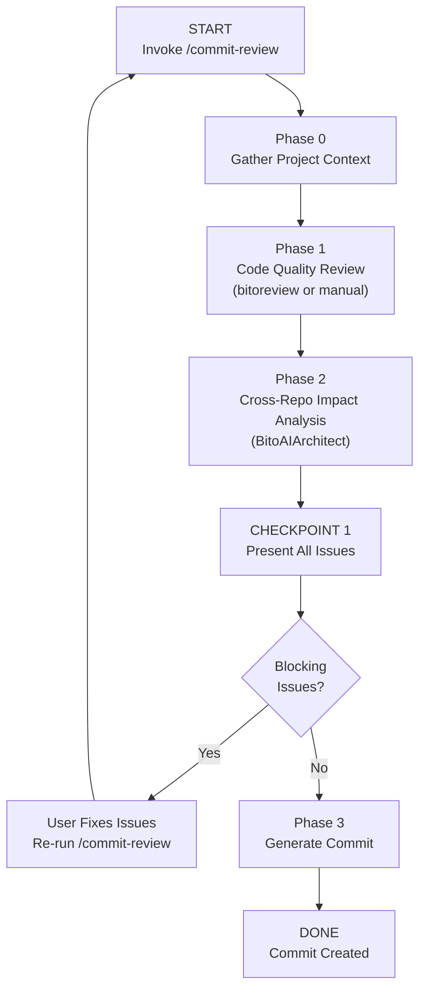

> **Requires:** BitoAIArchitect MCP server configured and running for cross-repo impact analysis.

# Pre-Commit Review with Cross-Repo Impact Analysis

## Purpose

This skill performs a comprehensive pre-commit review that:
1. **Gathers project context** from documentation files (CLAUDE.md, AGENTS.md, etc.)
2. **Reviews staged changes** using `bitoreview` CLI (if available) or manual analysis
3. **Analyzes cross-repo impact** using BitoAIArchitect to identify potential breaking changes
4. **Blocks commit** if critical issues are found, requiring resolution before proceeding
5. **Only allows commit** after all blocking issues are addressed

**This is a GATING workflow.** The commit should NOT proceed until this review passes.

---

## Staged Changes to Review

### Git Status
!`git status --short`!

### Staged Diff
!`git diff --staged --stat`!

### Recent Commits for Context
!`git log --oneline -5`!

### Current Branch
!`git branch --show-current`!

### BitoReview CLI Available
!`which bitoreview`!

---

## Valid Workflow (State Machine)



---

## Phase 0: Gather Project Context (MANDATORY)

**Before reviewing code, understand the project's rules, conventions, and architecture.**

Read and internalize context from these files (if they exist):

### 0.1 Project Documentation Files

Search for and read these files in order of priority (if they exist):

- [ ] **`CLAUDE.md`** (project root and parent directories) — project-specific instructions, coding standards, architectural decisions
- [ ] **`AGENTS.md`** — agent-specific instructions, review criteria, approval gates
- [ ] **`.cursorrules`** or **`cursor.rules`** — IDE coding standards, naming conventions
- [ ] **`.github/CODEOWNERS`** — code ownership, helps identify who to notify for cross-repo impact
- [ ] **`.editorconfig`** — formatting rules (indentation, line endings, charset)
- [ ] **`CONTRIBUTING.md`** — contribution guidelines, PR requirements, commit message format
- [ ] **`README.md`** — project overview and architecture context
- [ ] **`.pre-commit-config.yaml`** — existing pre-commit hooks and checks

### 0.2 Language-Specific Config Detection

Detect programming languages from the file extensions in the staged diff (e.g., `.go` → Go, `.rs` → Rust, `.py` → Python). Then, based on your knowledge of those languages:

1. **Identify the linter, formatter, and static analysis tools** commonly used for the detected language(s)
2. **Search the project root for their config files** (e.g., `.golangci.yml` for Go, `.rubocop.yml` for Ruby, `ruff.toml` for Python — use your knowledge, do not rely on a hardcoded list)
3. **Read any configs found** and apply their rules during the review

This approach is language-agnostic — it works for any language you recognize, without needing a predefined mapping.

### 0.3 Build Context Summary

After reading available files, create a mental model:

```
### Project Context Summary

**Project Type**: [e.g., TypeScript microservice, Python ML pipeline, Go CLI tool]
**Key Conventions**:
- [Convention 1 from docs]
- [Convention 2 from docs]

**Review Focus Areas** (from project docs):
- [Specific things this project cares about]

**Code Owners**: [If CODEOWNERS exists, note relevant owners for changed files]
```

**Use this context throughout the review to catch project-specific violations.**

---

## Phase 1: Code Quality Review

### 1.0 Check for BitoReview CLI

Check the **BitoReview CLI Available** output captured above (in the "Staged Changes to Review" section). If a file path was returned (e.g., `/usr/local/bin/bitoreview`), bitoreview IS installed — you MUST use it for Phase 1.1. If the output was empty or showed an error, bitoreview is NOT installed — proceed to Phase 1.2.

**Do NOT skip bitoreview when it is available.** It provides more comprehensive analysis than manual review.

### 1.1 If BitoReview is AVAILABLE (MANDATORY when installed)

Use `bitoreview` for comprehensive code review:

```bash
# Generate unique temp file
TEMP_FILE="/tmp/bitoreview_$(date +%s).json"

# Run bitoreview with JSON output
bitoreview review --prompt-only --type working 2>&1 | tee "$TEMP_FILE"
```

**After bitoreview completes — validate each issue:**

1. Parse the JSON output from the temp file
2. For each reported issue:
   - Read the actual code at the reported file:line
   - Reason about context: Does the issue exist? Is it exploitable? Does the fix make sense for this codebase?
   - **Include only verified issues** — silently discard false positives
3. Group verified issues by severity (high → medium → low)
4. Map to categories: `high` → BLOCKING, `medium` → WARNING, `low` → SUGGESTION

Validation matters: Static analysis tools have 30-60% false positive rates. Your job is to filter noise and present only real, actionable issues.

**BitoReview flags by intent:**
- Security focus: `--focus security`
- Performance focus: `--focus performance`
- Critical only (faster): `--mode essential`
- Compare to main: `--base main`

### 1.2 If BitoReview is NOT AVAILABLE (Fallback)

Perform manual review of staged changes for:

#### Correctness Issues (BLOCKING)
- Logic errors, off-by-one bugs, null pointer risks
- Incorrect API usage or contract violations
- Missing error handling for critical paths
- Race conditions or concurrency issues
- **Violations of project conventions** (from Phase 0 context)

#### Security Issues (BLOCKING)
- Hardcoded secrets, API keys, credentials
- SQL injection, XSS, command injection risks
- Insecure authentication or authorization
- Sensitive data exposure

#### Breaking Changes (BLOCKING)
- Public API signature changes
- Removed or renamed exports
- Changed return types or parameter requirements
- Database schema changes without migration

#### Quality Warnings (NON-BLOCKING)
- Code style inconsistencies (compare against project rules from Phase 0)
- Missing or incomplete documentation
- Suboptimal performance patterns
- Test coverage gaps

### 1.3 Project-Specific Checks

Based on Phase 0 context, also check:

- [ ] **Naming conventions** match project standards
- [ ] **File organization** follows project structure
- [ ] **Import patterns** match project conventions
- [ ] **Error handling** follows project patterns
- [ ] **Logging/observability** follows project standards
- [ ] **Test requirements** are met (if defined in docs)

**Create a checklist and mark each item:**
- [ ] Reviewed all staged files for correctness issues
- [ ] Checked for security vulnerabilities
- [ ] Identified any breaking changes
- [ ] Validated against project conventions (from Phase 0)
- [ ] Noted quality warnings

### 1.4 Validate All Identified Issues

**Applies to ALL issues — whether from BitoReview, manual review, or project rules:**

Before including any issue in the final report:
- Re-read the actual code to confirm the issue exists
- Reason about context: Is this a real problem or a misunderstanding?
- Consider: Does the suggested fix make sense for this specific code?
- **Only include verified issues** — silently discard false positives

This validation step prevents noise and ensures developers receive only actionable feedback.

---

## Phase 2: Cross-Repo Impact Analysis (MANDATORY)

**Do NOT skip this phase.** Even "simple" changes can have cross-repo impact.

Use BitoAIArchitect to analyze how these changes affect the broader system:

### 2.1 Identify the Repository Context

- [ ] **Get current repository info**
  - Use `getRepositoryInfo` with `includeIncomingDependencies=true` to find what depends on this repo
  - Use `getRepositoryInfo` with `includeOutgoingDependencies=true` to find what this repo depends on

### 2.2 Analyze Changed Interfaces

For each file with staged changes:

- [ ] **If it's an API endpoint/route**: Who calls this endpoint?
  - Use `searchCode` to find usages of the endpoint path across all repos
  - Use `searchSymbols` to find client implementations

- [ ] **If it's an exported function/class**: Who imports it?
  - Use `searchCode` for import statements referencing this module
  - Use `searchSymbols` to find usages of the function/class name

- [ ] **If it's a database model/schema**: Who uses this table?
  - Use `searchCode` for queries against this table
  - Use `searchRepositories` to find services with database dependencies

- [ ] **If it's a shared type/interface**: Who implements or consumes it?
  - Use `searchSymbols` for implementations
  - Use `searchCode` for type references

### 2.3 Map Blast Radius

Based on the dependency analysis, categorize impact:

```
### Cross-Repo Impact Assessment

**Direct Dependents** (services that directly call/import changed code):
- [Service A]: [how it uses the changed code]
- [Service B]: [how it uses the changed code]

**Transitive Dependents** (services that depend on direct dependents):
- [Service C]: [indirect impact path]

**Shared Infrastructure Impact**:
- [Database X]: [if schema changes affect it]
- [Cache Y]: [if cache keys/structure changes]

**Breaking Change Risk**: HIGH / MEDIUM / LOW / NONE
```

### 2.4 Verify Contract Compatibility

For any identified dependent services:

- [ ] Check if API contracts are maintained
- [ ] Verify type compatibility
- [ ] Confirm no breaking signature changes

### 2.5 Cross-Reference with CODEOWNERS

If CODEOWNERS was found in Phase 0:
- Identify owners of affected cross-repo code
- Note them for coordination in the commit message or PR

### 2.6 Validate Cross-Repo Findings

Before reporting any cross-repo impact:
- Verify the dependency actually exists (not stale data)
- Confirm the change actually affects the dependent code
- Check if the dependent service has already adapted (e.g., using optional fields)
- **Only report verified impacts** — discard false alarms

---

## CHECKPOINT 1: Present All Issues

Compile and present findings in this format:

### Issue Report

Present findings using this structure. Be concise - developers need actionable information, not verbose explanations.

<issue_report_format>

**Context:** Read [N] config files. Key rules: [2-3 rules from project docs]

---

**BLOCKING** (must fix before commit)

[B1] **[Category]: [Title]**
`file.ext:42` | Source: [BitoReview | Manual | Project Rule: X]

Problem: [One clear sentence explaining what's wrong]

Current code:
[Show the problematic code snippet]

Suggested fix:
[Show the corrected code snippet]

---

[B2] ...

---

**CROSS-REPO IMPACT** (review required)

[C1] **[Service Name]: [Impact Title]**
`changed-file.ext:15` | Risk: HIGH/MEDIUM/LOW | Owners: @team-name

What changed: [Brief description of the change]
Affected services:
- `service-a` uses this in `file.ext:23`
- `service-b` calls this endpoint

Action: [Specific recommendation]

---

[C2] ...

---

**SUGGESTIONS** (non-blocking)

[S1] **[Title]** `file.ext:88` | Source: [BitoReview | Project Rule: X]
[One sentence describing the suggestion and optional code improvement]

---

[S2] ...

</issue_report_format>

### Summary

Present a brief summary at the end:

```
Blocking: [N] | Cross-Repo Impact: [N] | Suggestions: [N]
Review Method: [BitoReview CLI | Manual] | Config Files: [N]
```

---

## Decision Gate

Based on the findings:

### If BLOCKING issues exist:

**COMMIT BLOCKED**

Present the blocking issues clearly and instruct:

```
COMMIT BLOCKED

The following [N] blocking issues must be resolved before committing:

[List blocking issues with file:line and brief description]

Please fix these issues and run /commit-review again.
```

**Do NOT proceed to Phase 3. Do NOT create the commit.**

### If only NON-BLOCKING warnings:

Ask the user: "Found [N] warnings but no blocking issues. Proceed with commit? (yes/no)"

- If user says yes -> Proceed to Phase 3
- If user says no -> End workflow

### If CROSS-REPO IMPACT warnings exist:

Present the impact analysis and ask:
"Found potential cross-repo impact on [N] services. Have you coordinated with the affected teams? (yes/no/details)"

- If user confirms coordination -> Proceed
- If user wants details -> Explain each impact in depth
- If user hasn't coordinated -> Recommend pausing commit

---

## Phase 3: Generate Commit (Only if Review Passes)

**Only reach this phase if:**
1. No blocking issues remain
2. User has acknowledged any warnings
3. Cross-repo impact has been reviewed/coordinated

### Generate Commit Message

Based on the staged changes and project conventions (from Phase 0), generate a commit message:

**Check CONTRIBUTING.md or project docs for commit message format.** If not specified, use conventional commits:

```
<type>(<scope>): <description>

<body explaining what changed and why>

<footer with any breaking change notes or cross-repo coordination notes>
```

Types: feat, fix, refactor, docs, test, chore, perf, style

### Execute Commit

Ask user: "Ready to commit with the above message? (yes/edit/cancel)"

- If yes -> Execute `git commit -m "<message>"`
- If edit -> Let user modify the message
- If cancel -> Abort without committing

---

## Anti-Patterns (Do NOT Do These)

| Anti-Pattern | Why It's Wrong |
|---|---|
| "This is a small change, skip cross-repo analysis" | Small changes can have outsized impact on dependents |
| "It's just a refactor, no functional changes" | Refactors can change public APIs and break imports |
| "The tests pass locally, so it's safe" | Local tests don't catch cross-repo integration issues |
| "I'll fix the warnings later" | Warnings accumulate and become blocking issues |
| "Let me commit now and fix in a follow-up" | Breaking changes deployed are costly to revert |
| "Skip reading project docs, I know the conventions" | Project rules may have changed or have nuances you missed |
| "Show all BitoReview findings without verifying" | Only present verified issues - validate against actual code first |

---

## Quick Reference: Project Context Files

| File | What It Contains |
|------|------------------|
| `CLAUDE.md` | Project-specific AI instructions, coding standards |
| `AGENTS.md` | Agent workflows, review criteria |
| `.cursorrules` | Cursor IDE coding rules |
| `CONTRIBUTING.md` | PR requirements, commit format |
| `CODEOWNERS` | Who owns which code paths |
| `.editorconfig` | Formatting rules |
| `.pre-commit-config.yaml` | Pre-commit hooks and checks |
| Language-specific configs | Detected from file extensions in the diff (see Phase 0.2) |

---

## Quick Reference: BitoAIArchitect Queries

| What You Need | Tool to Use |
|---|---|
| What depends on this repo? | `getRepositoryInfo(repo, includeIncomingDependencies=true)` |
| What does this repo depend on? | `getRepositoryInfo(repo, includeOutgoingDependencies=true)` |
| Find usages of a function | `searchSymbols(pattern)` + `searchCode(pattern)` |
| Find API endpoint consumers | `searchCode(endpoint_path)` |
| Understand repo clusters | `listClusters()` + `getClusterInfo(clusterId)` |
| Compare patterns across repos | `queryFieldAcrossRepositories(repos, fieldPath)` |

---

## Exit Criteria

This skill is complete when ONE of these is true:

1. **COMMIT CREATED**: All issues resolved, commit successfully created
2. **COMMIT BLOCKED**: Blocking issues presented, user needs to fix and re-run
3. **COMMIT CANCELLED**: User chose not to proceed after review

**Never end in an ambiguous state.** Always clearly communicate whether the commit happened or not.
