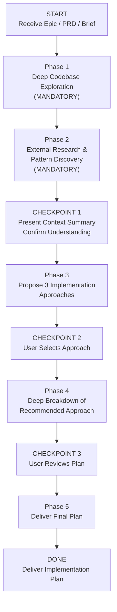

>  **Requires:** BitoAIArchitect MCP server configured and running. Web search must be available for external research. Optionally uses `bito-codebase-explorer`, `bito-feature-plan`, `bito-trd`, and `bito-production-triage` for deeper analysis.

# Epic-to-Plan: Implementation Planning with AI Architect

## Purpose

Take an approved epic, PRD, Jira ticket, or feature brief and produce a **complete implementation plan** — from architectural approach selection through to sprint-ready tickets an engineer could start working from tomorrow.

**This is the bridge between "what to build" and "how to build it."**

**How this differs from other skills:**
- **Feasibility** answers "should we commit?" This skill assumes the decision is made.
- **Feature Plan** produces a sequenced task list for one engineer. This skill produces the *full plan* including approach selection, architecture diagrams, workstream deep-dives, and cross-cutting concerns — then breaks that into tickets.
- **TRD** produces a technical design document. This skill *includes* a design but also produces the implementation tickets, sequencing, and rollout plan.

**When to use this vs. other skills:**
- User has an epic and wants to go straight to "how do we build this?" → **This skill.**
- User wants to evaluate whether something is worth building → **Feasibility.**
- User needs a standalone technical design document for review → **TRD.**
- User is one engineer who needs step-by-step coding instructions → **Feature Plan.**

## Accepted Inputs

The user will provide one or more of:
- A Jira epic (title, description, acceptance criteria, linked tickets)
- A PRD or spec document
- A feature brief or Slack thread summary
- An approved item from another skill's output

Parse whatever is provided and begin with Phase 1.

## Valid Workflow (State Machine)



The ONLY valid terminal state is `DONE`. You MUST pass through every phase and checkpoint in order. There are no shortcuts.

---

## Anti-Rationalization Table

| Rationalization | Why It's Wrong |
|---|---|
| "I can plan this from the requirements alone" | Requirements describe *what*. The plan requires knowing the codebase topology, existing patterns, data models, and integration points. Without AI Architect, the plan will conflict with how the system is actually built. |
| "This is straightforward — skip to tickets" | "Straightforward" features in complex codebases routinely touch shared databases, event buses, and libraries owned by other teams. Skipping exploration leads to mid-sprint surprises. |
| "I already explored this codebase recently" | Context from a previous task is stale. Each plan needs fresh, feature-specific queries. The same service may have changed, or a different part of it is relevant. |
| "One approach is obviously right" | Presenting one approach without alternatives means the team can't evaluate trade-offs. Even when one approach is clearly best, showing what was considered and rejected builds confidence. |
| "External research doesn't apply — our system is unique" | Every system is unique in its specifics. But the architectural *patterns* (sync engines, feed ingestion, cache strategies, event sourcing) are shared. Industry experience reveals pitfalls you can't infer from code alone. |
| "Cross-cutting concerns can be handled during implementation" | Observability, rollback strategy, feature flags, and migration plans are architectural decisions. Deferring them to implementation causes rework and incidents. |

**This skill applies to EVERY implementation plan regardless of perceived simplicity.**

---

## Phase 1: Deep Codebase Exploration (MANDATORY — DO NOT SKIP)

Before writing a single line of planning, build a thorough mental model of the system. Use AI Architect MCP and the `bito-codebase-explorer` skill patterns. Document findings as you go.

**Do NOT proceed to Phase 2 until you have run AT LEAST 8 AI Architect queries across the categories below.**

### 1.1 Identify the Domain Boundary

Read the epic carefully. Extract:
- The **core nouns** (entities the feature revolves around)
- The **core verbs** (operations the feature performs)
- The **user roles** mentioned

Then use AI Architect to answer:
- Which services own or touch each core noun?
- What is the data model for each core noun?
- How does each core verb currently work end to end? Trace the request path.
- What APIs currently exist for these entities?

Tools: `searchRepositories`, `searchSymbols`, `getCode`, `getRepositoryInfo`

### 1.2 Map the Service Topology

Build a map of all affected services:
- What services call the affected services, and what do those services call?
- What databases and data stores does each service read from and write to?
- Are there event buses, message queues, or async workflows involved?
- What shared libraries or internal SDKs are used across these services?

For each service, note: language/framework, deployment model, repo location, team owner.

Tools: `getRepositoryInfo` with `includeIncomingDependencies` and `includeOutgoingDependencies`, `listClusters`, `getClusterInfo`

### 1.3 Trace Existing Analogous Flows

Find the closest existing feature to what's being built:
- Is there an existing workflow similar to the epic?
- How does the closest existing feature handle the hardest part of the new epic?
- Trace the most relevant existing flow end to end — from API entry through DB persistence and downstream side effects.

This is the pattern the new implementation should follow unless there's a strong reason to diverge.

Tools: `searchSymbols`, `getCode`

### 1.4 Identify Integration Points & External Dependencies

- What external systems or third-party APIs does the domain area integrate with?
- Are there partner or vendor data feeds involved?
- What auth/authz model governs access to this domain?
- How is data ingested from external sources today?

Tools: `searchRepositories`, `searchSymbols`, `getRepositoryInfo`

### 1.5 Understand the Data Layer Deeply

- What is the schema for core tables/collections?
- Are there existing migration patterns or schema evolution strategies?
- Where does each data entity get created, updated, and read? All touchpoints.
- Is there a caching layer? What invalidation strategy?
- Are there data pipeline or ETL jobs that transform/aggregate this data?

Tools: `searchSymbols` for models/schemas/migrations, `getCode` for schema definitions

### 1.6 Review Architectural Health

Assess the health of services this plan will build on:
- **Tech debt and design debt** — TODOs, hack comments, known abstraction gaps
- **Incident history** — past outages or degradations in the affected area (use `bito-production-triage` patterns)
- **Scalability constraints** — known throughput ceilings, latency hotspots
- **Test coverage** — integration tests, e2e tests, load test infrastructure

These findings directly inform approach selection in Phase 3. Building on an unstable service is a different risk profile than building on a healthy one.

### 1.7 Check for Landmines

- Known tech debt items, TODOs, or hack comments in the affected area?
- Feature flags or experiments currently running?
- Recent deployments or config changes that might interact?
- Known race conditions, concurrency issues, or data consistency problems?
- What test coverage exists? Unit, integration, e2e? Are there gaps that increase risk for this plan?
- Have there been recent incidents or production issues in the affected services?

---

## Phase 2: External Research & Pattern Discovery (MANDATORY)

Before proposing approaches, research how others have solved similar problems. This ensures recommendations are informed by both the codebase and industry experience.

**Do NOT skip this phase.** Run at least 2 substantive web searches.

### 2.1 How Others Have Solved This Problem

Use web search to find engineering blog posts, case studies, and conference talks about the core domain. Focus on:
- Companies at similar scale or in the same industry
- Open-source projects or frameworks that address part of the problem
- Reference architectures from cloud providers or platform vendors

### 2.2 Industry Standards & Protocols

- Established data formats, APIs, or protocols relevant to this domain?
- Vendor APIs or partner integration patterns considered best practice?
- Compliance or regulatory considerations?

### 2.3 Known Pitfalls

- Post-mortems or failure stories from teams that built similar systems?
- Well-documented anti-patterns?
- Scaling bottlenecks others hit, and at what thresholds?

### 2.4 Synthesis

Summarize: what patterns are worth borrowing, what pitfalls to avoid, whether any external tools/libraries/standards should factor into the approaches. Be specific — "Company X used an event-driven sync engine and hit Y scaling issue at Z throughput" is useful. Generic advice is not.

---

## CHECKPOINT 1: Present Context Summary

After Phases 1 and 2, present a **Context Summary**:

1. **Services & Repos Affected**: List with brief descriptions, team ownership, and degree of change
2. **Service Topology Diagram**: ASCII diagram showing how affected services interact
3. **Data Model Summary**: Core entities, schemas, and storage locations
4. **Closest Existing Analogue**: The most similar existing flow and what it teaches
5. **Integration Points**: External systems, third-party APIs, auth boundaries
6. **Architectural Health Signals**: Tech debt, incident history, or scalability concerns in the affected area
7. **External Insights**: Key patterns, pitfalls, or standards from industry research
8. **Landmines**: Feature flags, recent changes, known issues in the area

**Ask the user**: "Here's what I found about the system and how others have built similar features. Does this match your understanding? Anything I should explore further before proposing approaches?"

**Do NOT proceed until the user confirms.**

---

## Phase 3: Propose 3 Implementation Approaches

Based on codebase exploration AND external research, propose **the 3 best approaches for this specific epic**. These must be genuinely different architectural strategies — not variations in task ordering.

Think through approaches like these for inspiration, but pick the 3 that actually make sense given what you found:
- Extend the closest existing flow with minimum new surface area
- Introduce a new bounded context/service with clean interfaces
- Ship fast by extending now, but lay abstractions for future extraction
- Event-driven approach vs. synchronous orchestration
- Build vs. integrate (is there an internal or external system that already solves part of this?)
- Thin vertical slice first vs. horizontal layer-by-layer
- Adopt an external pattern or framework discovered in Phase 2

**Pick the 3 a senior engineer would actually debate in an architecture review.** Don't force-fit generic patterns.

### Format for Each Approach

Keep each approach **concise and scannable** — under one page. Focus on what's different between approaches.

For each approach:

**1. Name + one-line philosophy**

**2. Architecture diagram** (ASCII):
```
  [Existing UI] ──▶ [Campaign API] ──▶ [NEW: Module] ──▶ [Data Store]
                          │                    │
                          ▼                    ▼
                    [Service A]          [Feed Ingestion]
```

**3. Key workstreams** (table):

| Workstream | Repos/Services Affected | Scope | What's tricky |
|---|---|---|---|
| ... | ... | S/M/L/XL | ... |

**4. Strengths** — 2-3 bullets, specific to codebase and research findings

**5. Risks** — 2-3 bullets, honest and evidence-grounded

**6. What it defers** — what this approach intentionally leaves for later

**7. Effort summary** (both estimates):

| | Traditional | Agentic |
|---|---|---|
| **Total** | [size] | [size] |

---

## CHECKPOINT 2: User Selects Approach

Present all 3 approaches. Ask: "Which approach should I develop into a full implementation plan? Or would you prefer a hybrid?"

**Do NOT proceed until the user chooses.**

---

## Phase 4: Deep Breakdown of Recommended Approach

This section must be **exhaustive** — detailed enough that an engineer could start working from it tomorrow.

### 4.1 Full Architecture Diagram

Expand the Phase 3 sketch into a complete system diagram. Label:
- New vs. modified components
- Sync vs. async boundaries
- Data flow direction and protocol
- All DB reads/writes
- All external integrations

### 4.2 Workstream Deep Dives

For each workstream:

- **Affected repos** — exact paths from AI Architect
- **Database changes** — specific tables, columns, indexes, migrations
- **API changes** — specific endpoints, request/response shapes, versioning
- **New code** — modules, classes, packages to create
- **Modified code** — existing files to change and what changes
- **Config / feature flags** — toggles needed for safe rollout
- **Testing requirements** — unit, integration, e2e, load

### 4.3 Effort Estimates

Provide **dual estimates** per workstream:

| Workstream | Traditional | Agentic (Cursor / Claude Code) | What drives the difference |
|---|---|---|---|
| ... | X-Y eng-days | X-Y eng-days | ... |

**Traditional** = experienced engineer writing code manually, own review, tests by hand.
**Agentic** = experienced engineer using AI tooling — still reviewing and directing.

Be honest about where agentic tools compress timelines (CRUD, boilerplate, test scaffolding, data migrations, API glue) vs. where they help less (novel architecture, complex state machines, concurrency, security-sensitive logic).

### 4.4 Task Breakdown (Jira/Linear-Ready)

Break down into concrete tickets:

```
EPIC: [Epic Title]

  WORKSTREAM 1: [Name]
  │
  ├── STORY: [User-facing capability or milestone]
  │   │
  │   ├── TASK: [Specific implementable unit of work]
  │   │     Repo: [repo name]
  │   │     Labels: backend | frontend | data | infra | devops | qa
  │   │     Est (trad): Xd  |  Est (agentic): Xd
  │   │     Blocked by: [ticket ref or "none"]
  │   │     AC:
  │   │       - [Concrete acceptance criterion 1]
  │   │       - [Concrete acceptance criterion 2]
  │   │
  │   └── TASK: ...
  │
  ├── STORY: ...
  │
  WORKSTREAM 2: [Name]
  ├── STORY: ...
  ...
```

**Rules:**
- Each TASK ≤ 3 days (traditional estimate). If bigger, split it.
- Acceptance criteria must be testable. Not "it works" — specify exact expected behavior.
- Dependencies explicit. Flag parallel-safe tasks.
- Include non-obvious tasks: migrations, feature flags, config, monitoring/alerting, docs, runbooks, load tests.
- Include tasks surfaced by external research (Phase 2) that aren't obvious from the codebase alone.

### 4.5 Sequencing & Critical Path

Show execution order visually:

```
Week 1-2          Week 3-4          Week 5-6          Week 7-8
─────────────────────────────────────────────────────────────────
[DB migrations]──▶[API endpoints]──▶[Integration]───▶[QA & Launch]
                  [Feed ingestion]─▶[Sync engine]──┘
[Feature flags]   [UI scaffolding]─▶[UI complete]──▶[E2E tests]
```

Show: parallel workstreams, critical path, milestones, go/no-go points.

Provide **two timeline estimates**:
- **Traditional**: [X-Y weeks]
- **Agentic**: [X-Y weeks]

### 4.6 Cross-Cutting Concerns

Address each — skip none:

- **Data Migration:** Backfilling or transformation needed? Zero-downtime strategy?
- **Backward Compatibility:** Incremental deploy without breaking existing clients?
- **Rollback Strategy:** Plan per phase — what can be reverted and what can't?
- **Observability:** New metrics, logs, alerts, dashboards? What failure modes need monitoring?
- **Performance:** Latency/throughput concerns? Load testing plan?
- **Security / Access Control:** New permission boundaries? Auth changes?
- **Testing Strategy:** Integration, load, contract tests? Gaps in current coverage?
- **Documentation:** Runbooks, API docs, architecture decision records?

### 4.7 Risks & Mitigations

| Risk | Likelihood | Impact | Mitigation | Early Warning Signal |
|---|---|---|---|---|
| ... | Low/Med/High | Low/Med/High | ... | ... |

Include risks surfaced from both codebase analysis and external research.

### 4.8 Open Questions

| # | Question | Why It Matters | Who Should Answer | Suggested Default If No Answer |
|---|---|---|---|---|
| 1 | ... | What decision it blocks | product / eng / data / infra | ... |

---

## CHECKPOINT 3: User Reviews Plan

Present the full plan. Ask: "Does this plan look right? Are the workstreams, tickets, and sequencing realistic? Any adjustments before I finalize?"

**Do NOT proceed until approved.**

---

## Phase 5: Deliver Final Plan

Apply the output template from `references/output-templates.md`.

---

## Execution Notes

These apply to every phase. Revisit before finalizing output.

1. **Show your work.** When referencing a service, repo, table, or API, cite which AI Architect query surfaced it. When referencing external patterns, cite the source URL or blog post.
2. **Be concrete.** "Add a `promo_sync_enabled` boolean to `advertiser_settings` in `commerce-api`" — not "update the database." Specificity is the difference between a plan and a wish.
3. **Flag uncertainty.** If AI Architect returns incomplete results, say so rather than filling gaps with assumptions. Mark claims ✅ (confirmed from code), ⚠️ (inferred), or ❓ (speculative). Never present a guess as a fact.
4. **Scope to MVP.** Clearly delineate MVP vs. follow-on in every workstream. When in doubt: "Can the core user story work without this?" If yes, it's follow-on.
5. **Dual estimates enable honest planning.** Teams using AI tooling plan from the Agentic column. Teams not using it plan from Traditional. Don't mix columns in one sprint plan — pick the one that matches the team's actual workflow.
6. **Use other skills for depth.** After the plan, consider running `bito-feature-plan` on specific workstreams for step-by-step coding instructions, or `bito-trd` for a formal technical design document.
