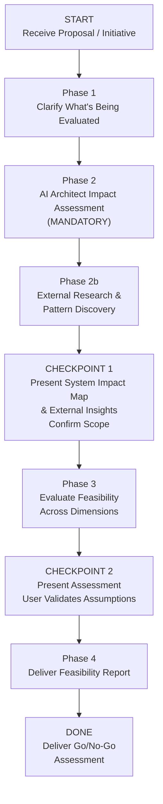

>  **Requires:** BitoAIArchitect MCP server configured and running. Ensure BitoAIArchitect MCP server is configured first.

# Feasibility / Impact Analysis with AI Architect

## Purpose
Produce a structured assessment of viability, effort, risk, and blast radius **before** the team commits to building something. The output is a **decision-support document** — it tells stakeholders whether to proceed, pivot, or abandon, and what the real cost would be. This is not a plan (Feature Plan), not a design (TRD), and not an investigation of unknowns (Spike). It is a first-pass evaluation that assumes the feature is understood but the cost and risk are not.

**How this differs from other skills:**
- **Spike** asks "do we know enough?" Feasibility asks "given what we know, should we commit?"
- **Feature Plan / TRD** assume the decision to build is made. Feasibility informs that decision.
- **Epic Breakdown** assumes scope is approved. Feasibility evaluates whether the scope is realistic.

## Valid Workflow (State Machine)

The ONLY valid terminal state is `DONE`. You MUST pass through every phase and checkpoint in order. There are no shortcuts.

---

## Anti-Rationalization Table

| Rationalization | Why It's Wrong |
|---|---|
| "The feature is already approved — no need for feasibility" | Approved ≠ feasible. Stakeholders approved the *idea*. You're assessing the *cost*. Many approved features get descoped or restructured after feasibility review. |
| "I can estimate effort from the feature description" | Effort depends on existing code complexity, test coverage, shared dependencies, migration needs, and team topology. You need codebase context. |
| "This is clearly feasible — it's just a CRUD feature" | "Just CRUD" in a microservices architecture can mean schema migrations across 3 databases, contract changes on 5 APIs, and cache invalidation in 2 services. Check before assuming. |
| "Impact analysis is overkill for this" | The point of impact analysis is to catch the cases where you *think* it's small but it's not. That's exactly when it's most valuable. |
| "I'll just list the risks without investigating" | Risk without evidence is worry. Risk grounded in codebase analysis is actionable intelligence. |
| "External research is unnecessary — I know the patterns" | Industry post-mortems, scaling failures, and anti-patterns from teams that built similar systems reveal pitfalls you cannot infer from the codebase alone. |

**This skill applies to EVERY feasibility analysis regardless of perceived simplicity.**

---

## Phase 1: Clarify What's Being Evaluated

Before investigating, establish:

- **What** is the proposal? (Feature, migration, refactor, integration, deprecation)
- **Who** is the decision-maker? (Who needs the go/no-go recommendation)
- **What are the decision criteria?** (Effort threshold, risk tolerance, timeline constraint)
- **What alternatives exist?** (Build vs. buy, approach A vs. B, do now vs. defer)
- **What's the expected benefit?** (Business value, user impact, tech debt reduction)

If the proposal is vague, ask clarifying questions before proceeding.

---

## Phase 2: AI Architect Impact Assessment (MANDATORY)

**Do NOT proceed to Phase 2b until you have run AT LEAST 6 AI Architect queries across the categories below and documented what you found. Feasibility assessments without AI Architect evidence are INVALID.**

You MUST create a task checklist and complete each item:

- [ ] **Blast Radius — What Gets Touched**
  Which repos, services, databases, and APIs would this proposal affect?
  - `searchRepositories` for feature-area keywords
  - `getRepositoryInfo` with full detail for candidate repos
  - `getRepositoryInfo` with `includeIncomingDependencies` and `includeOutgoingDependencies` for each affected repo
  - `listClusters` for cluster-level impact

- [ ] **Dependency Chain — What Blocks What**
  If this proposal requires changes in Service A, what else must change? What's the cascading impact?
  - `getClusterInfo` for cluster dependencies
  - `queryFieldAcrossRepositories` for incoming dependencies on affected services

- [ ] **Existing Complexity — How Hard Is the Current Code**
  Is the target area clean and well-patterned, or tangled and fragile?
  - `searchSymbols` for the target area's key types, functions, handlers
  - `getCode` for key implementation files — assess complexity, test coverage signals, code age

- [ ] **Shared Infrastructure — What's Shared**
  Does this proposal touch shared databases, event buses, config systems, or libraries used by other teams?
  - `searchRepositories` for shared infrastructure repos
  - `getRepositoryInfo` for shared components with dependency counts

- [ ] **Migration Surface — What Needs to Move**
  Does this require data migrations, API version bumps, contract changes, or config updates?
  - `searchSymbols` for schema definitions, migration files, API versions
  - `getCode` for current schemas and contracts that would change

- [ ] **Similar Past Work — Has This Been Tried Before**
  Has the org attempted something similar? What happened?
  - `searchRepositories` for related feature keywords
  - `searchSymbols` for deprecated or legacy versions of similar functionality

- [ ] **Architectural Health — Is the Foundation Stable**
  What is the health of the services this proposal would build on or extend?
  - Check for known tech debt items, TODOs, or hack comments in the affected area
  - Look for recurring bug patterns or incident history in affected services
  - Identify scalability constraints or known throughput ceilings
  - Use `bito-production-triage` patterns to check for recent incident history if applicable

  These findings directly inform risk assessment in Phase 3 — building on an unstable foundation changes the risk calculus.

---

## Phase 2b: External Research & Pattern Discovery

Before evaluating feasibility, research how others have approached similar problems. This ensures recommendations are informed by both the actual codebase and industry experience.

**Do NOT skip this phase.** External context reveals pitfalls and validated patterns that cannot be inferred from the codebase alone.

### 2b.1 How Others Have Solved This Problem

Use web search to find engineering blog posts, case studies, and conference talks about the core domain. Focus on:
- Companies at similar scale or in the same industry
- Open-source projects or frameworks that address part of the problem
- Reference architectures from cloud providers or platform vendors

### 2b.2 Industry Standards & Protocols

- Are there established data formats, APIs, or protocols relevant to this domain?
- Are there vendor APIs or partner integration patterns considered best practice?
- Are there compliance or regulatory considerations?

### 2b.3 Known Pitfalls

- Post-mortems or failure stories from teams that built similar systems?
- Well-documented anti-patterns for this type of work?
- Scaling bottlenecks others hit, and at what thresholds?

### 2b.4 Synthesis

Summarize: what patterns are worth borrowing, what pitfalls to avoid, whether any external tools/libraries/standards should factor into the alternatives comparison. Be specific — "Company X used an event-driven sync engine and hit Y scaling issue at Z throughput" is useful. Generic advice is not.

---

## CHECKPOINT 1: Present System Impact Map & External Insights

After Phase 2 and 2b, present an **Impact Map**:

1. **Services Affected**: List with degree of change (heavy modification / light touch / read-only dependency)
2. **Blast Radius Diagram**: Visual of what the proposal touches and what depends on those things
3. **Shared Resources at Risk**: Databases, caches, queues, libraries that multiple teams depend on
4. **Migration Requirements**: Schema changes, contract changes, data backfills identified
5. **Architectural Health Signals**: Known instability, tech debt, or incident patterns in affected areas
6. **External Insights**: Key patterns, pitfalls, or standards discovered from industry research
7. **Surprises**: Anything the proposal didn't account for

**Ask the user**: "Here's the impact map and external research. Does this match your expectations? Are there areas I should investigate further?"

**Do NOT proceed until the user confirms.**

---

## Phase 3: Evaluate Feasibility Across Dimensions

Assess the proposal against each dimension. Every assessment must cite evidence from Phase 2/2b.

### Dimension 1: Technical Viability
- Can the current architecture support this?
- Are there hard technical blockers (schema limitations, missing infrastructure, incompatible patterns)?
- What would need to be built vs. extended vs. replaced?
- Do external patterns suggest a viable path, or do industry post-mortems reveal fundamental challenges?

### Dimension 2: Effort Estimation

Provide **two estimates** for each area — Traditional and Agentic:

| Area | Traditional | Agentic (Cursor / Claude Code) | Basis | What drives the difference |
|---|---|---|---|---|
| Schema / data model | M | S | [Evidence from codebase] | Migrations are boilerplate-heavy, well-suited to agentic scaffolding |
| Service logic | L | M | [Evidence from codebase] | Novel state machine; agentic helps with tests but not core logic |
| API / contracts | S | S | [Evidence from codebase] | Versioning pattern exists, small surface |
| Frontend | M | S-M | [Evidence from codebase] | Component library exists; CRUD views compress well |
| Testing | M | S | [Evidence from codebase] | Test patterns established; scaffolding is agentic sweet spot |
| Migration / backfill | L | M | [Evidence from codebase] | Script generation compresses, but validation is manual |
| **Total** | **[size]** | **[size]** | | |

**Traditional** = experienced engineer writing code manually, own review, tests by hand.
**Agentic** = experienced engineer using Cursor, Claude Code, or similar AI tooling — still reviewing and directing.

Where agentic tools compress timelines: CRUD, boilerplate, test scaffolding, data migrations, API glue, config files, documentation.
Where they help less: novel architecture, complex state machines, concurrency, security-sensitive logic, nuanced business rules.

### Dimension 3: Risk Assessment
- **Technical risks**: Fragile code, missing tests, complex migrations, shared resource contention
- **Coordination risks**: Cross-team dependencies, handoff points, contract negotiations
- **Operational risks**: Deployment complexity, rollback difficulty, monitoring gaps
- **Risks surfaced by external research**: Scaling bottlenecks, anti-patterns, or failure modes observed at other organizations
- Each risk must cite the specific codebase or external evidence that surfaced it

### Dimension 4: Dependency & Sequencing
- What must happen first? What blocks what?
- Are there external team dependencies or infrastructure prerequisites?
- What's the critical path?

### Dimension 5: Alternatives Comparison
- For each alternative (including "do nothing"), assess effort, risk, and value
- Incorporate external patterns — is there a build-vs-buy or adopt-vs-build-from-scratch option informed by Phase 2b?
- Identify which alternative best fits the stated decision criteria

---

## CHECKPOINT 2: Present Assessment

Present the assessment across all dimensions. Ask: "Does this assessment match your understanding? Are my effort estimates and risk assessments reasonable? Any assumptions I should revisit?"

**Do NOT proceed until validated.**

---

## Phase 4: Deliver Feasibility Report

Apply the output template from `references/output-templates.md`.

---

## Notes

- **This is a decision-support document, not a plan.** The output helps stakeholders decide whether to proceed. If they say GO, other skills (Feature Plan, TRD, Epic Breakdown) take over.
- **Effort estimates are ranges, not commitments.** T-shirt sizes with explicit basis from the codebase are more honest and useful than made-up point estimates. The dual Traditional/Agentic format helps teams plan realistically based on their actual tooling.
- **The "Do Nothing" option is always evaluated.** Every feasibility analysis must assess the cost of inaction. Sometimes the right answer is "not now."
- **External research grounds industry risk.** Phase 2b findings should appear in the risk register and alternatives comparison — not as a separate section disconnected from the assessment.
- **Confidence labels are mandatory.** Every claim must be tagged ✅ (confirmed from code), ⚠️ (inferred from architecture), or ❓ (speculative). Stakeholders need to know what's solid and what's a guess.
- **Surprises are the highest-value output.** The things the proposal didn't account for — hidden dependencies, shared resource contention, migration complexity, industry-documented failure modes — are often more important than confirming what was expected.
- If the analysis reveals the proposal is significantly more complex than anticipated, surface this prominently in the Executive Summary rather than burying it in tables.
