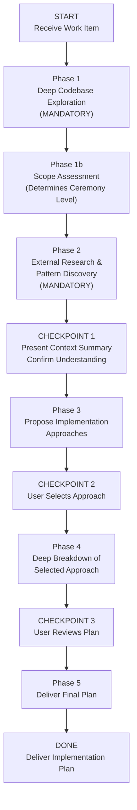

>  **Requires:** BitoAIArchitect MCP server configured and running. Web search must be available for external research. Optionally uses `bito-codebase-explorer`, `bito-feature-plan`, `bito-trd`, and `bito-production-triage` for deeper analysis.

# Scope-to-Plan: Implementation Planning with AI Architect

## Purpose

Take any approved unit of work — epic, story, PRD, Jira ticket, or feature brief — and produce a **complete implementation plan**. The plan covers architectural approach selection, detailed design, and sprint-ready tickets an engineer could start working from tomorrow.

**This is the bridge between "what to build" and "how to build it."**

The skill **automatically scales its ceremony to match the input size**. A multi-sprint epic gets a full multi-workstream plan with 3+ approaches compared. A well-scoped story gets a focused plan with the right number of approaches for its complexity. The core workflow is the same — what changes is the depth per section, not the structure.

**How this differs from other skills:**
- **Feasibility** answers "should we commit?" This skill assumes the decision is made.
- **Feature Plan** produces a sequenced task list for one engineer. This skill produces the *full plan* including approach evaluation, architecture diagrams, and cross-cutting concerns — then breaks that into tickets.
- **TRD** produces a technical design document. This skill *includes* a design but also produces implementation tickets, sequencing, and rollout plan.

**When to use this vs. other skills:**
- User has a work item and wants "how do we build this?" → **This skill.**
- User wants to evaluate whether something is worth building → **Feasibility.**
- User needs a standalone technical design document for review → **TRD.**
- User is one engineer who needs step-by-step coding instructions → **Feature Plan.**

## Accepted Inputs

The user will provide one or more of:
- A Jira epic or story (title, description, acceptance criteria, linked tickets)
- A PRD or spec document
- A feature brief or Slack thread summary
- An approved item from another skill's output

Parse whatever is provided and begin with Phase 1.

## Valid Workflow (State Machine)



The ONLY valid terminal state is `DONE`. You MUST pass through every phase and checkpoint in order. There are no shortcuts.

---

## Anti-Rationalization Table

| Rationalization | Why It's Wrong |
|---|---|
| "I can plan this from the requirements alone" | Requirements describe *what*. The plan requires knowing the codebase topology, existing patterns, data models, and integration points. Without AI Architect, the plan will conflict with how the system is actually built. |
| "This is straightforward — skip to tickets" | "Straightforward" items in complex codebases routinely touch shared databases, event buses, and libraries owned by other teams. Skipping exploration leads to mid-sprint surprises. |
| "I already explored this codebase recently" | Context from a previous task is stale. Each plan needs fresh queries. The same service may have changed, or a different part of it is relevant. |
| "There's only one way to do this — skip approach comparison" | Even when one approach seems obvious, there are almost always genuine alternatives worth evaluating. If there truly is only one viable path, present it with a note on what was considered and why alternatives don't apply. Never fabricate approaches to fill a quota, but never skip evaluation to save time. |
| "External research doesn't apply — our system is unique" | Every system is unique in its specifics. But the architectural *patterns* are shared. Industry experience reveals pitfalls you can't infer from code alone. |
| "Cross-cutting concerns can be handled during implementation" | Observability, rollback strategy, feature flags, and migration plans are architectural decisions. Deferring them to implementation causes rework and incidents. |
| "This story is too small for a plan" | The Scope Assessment (Phase 1b) determines ceremony, not your assumption. Even small stories benefit from codebase exploration and a structured plan — the plan is just shorter. |

**This skill applies to EVERY implementation plan regardless of perceived simplicity.**

---

## Phase 1: Deep Codebase Exploration (MANDATORY — DO NOT SKIP)

Before writing a single line of planning, build a thorough mental model of the system. Use AI Architect MCP and the `bito-codebase-explorer` skill patterns. Document findings as you go.

**Minimum queries scale with ceremony level (determined in Phase 1b, but start exploring immediately):**
- **Large**: AT LEAST 8 AI Architect queries
- **Medium**: AT LEAST 5 AI Architect queries
- **Small**: AT LEAST 3 AI Architect queries

### 1.1 Identify the Domain Boundary

Read the input carefully. Extract:
- The **core nouns** (entities the work revolves around)
- The **core verbs** (operations the work performs)
- The **user roles** mentioned

Then use AI Architect to answer:
- Which services own or touch each core noun?
- What is the data model for each core noun?
- How does each core verb currently work end to end? Trace the request path.
- What APIs currently exist for these entities?

Tools: `searchRepositories`, `searchSymbols`, `getCode`, `getRepositoryInfo`

### 1.2 Map the Service Topology

Build a map of all affected services:
- What services call the affected services, and what do those services call?
- What databases and data stores does each service read from and write to?
- Are there event buses, message queues, or async workflows involved?
- What shared libraries or internal SDKs are used across these services?

For each service, note: language/framework, deployment model, repo location, team owner.

Tools: `getRepositoryInfo` with `includeIncomingDependencies` and `includeOutgoingDependencies`, `listClusters`, `getClusterInfo`

### 1.3 Trace Existing Analogous Flows

Find the closest existing feature to what's being built:
- Is there an existing workflow similar to the input?
- How does the closest existing feature handle the hardest part?
- Trace the most relevant existing flow end to end — from API entry through DB persistence and downstream side effects.

This is the pattern the new implementation should follow unless there's a strong reason to diverge.

Tools: `searchSymbols`, `getCode`

### 1.4 Identify Integration Points & External Dependencies

- What external systems or third-party APIs does the domain area integrate with?
- Are there partner or vendor data feeds involved?
- What auth/authz model governs access to this domain?
- How is data ingested from external sources today?

Tools: `searchRepositories`, `searchSymbols`, `getRepositoryInfo`

### 1.5 Understand the Data Layer Deeply

- What is the schema for core tables/collections?
- Are there existing migration patterns or schema evolution strategies?
- Where does each data entity get created, updated, and read? All touchpoints.
- Is there a caching layer? What invalidation strategy?
- Are there data pipeline or ETL jobs that transform/aggregate this data?

Tools: `searchSymbols` for models/schemas/migrations, `getCode` for schema definitions

### 1.6 Review Architectural Health

Assess the health of services this plan will build on:
- **Tech debt and design debt** — TODOs, hack comments, known abstraction gaps
- **Incident history** — past outages or degradations in the affected area (use `bito-production-triage` patterns)
- **Scalability constraints** — known throughput ceilings, latency hotspots
- **Test coverage** — integration tests, e2e tests, load test infrastructure

These findings directly inform approach selection in Phase 3.

### 1.7 Check for Landmines

- Known tech debt items, TODOs, or hack comments in the affected area?
- Feature flags or experiments currently running?
- Recent deployments or config changes that might interact?
- Known race conditions, concurrency issues, or data consistency problems?
- What test coverage exists? Unit, integration, e2e? Are there gaps that increase risk?
- Have there been recent incidents or production issues in the affected services?

---

## Phase 1b: Scope Assessment

After initial exploration, assess the input size to determine ceremony level.

### Assessment Criteria

| Signal | Points toward Large | Points toward Medium | Points toward Small |
|---|---|---|---|
| Teams involved | Multiple teams / ownership boundaries | One team, 2-3 repos | One engineer, one repo |
| Duration | Multi-sprint / quarter-level | 1-2 sprints | Days of work |
| Services touched | 3+ services with cross-service deps | 1-2 services | Single service or module |
| Data model changes | Schema migrations across multiple DBs | Schema change in one DB | No schema changes, or additive-only |
| Architectural choices | Multiple genuinely different strategies | Some variation in approach | Implementation path is fairly clear |

### Ceremony Levels

**Large** (multi-team epic / initiative):
- Full exploration (all 1.1–1.7 sections)
- Full external research
- Approaches: present every genuinely distinct approach with full architecture diagrams, workstream tables, and effort summaries
- Full workstream deep-dives, full cross-cutting concerns
- Full task breakdown with sequencing timeline

**Medium** (single-team epic / large story):
- Full exploration (all 1.1–1.7 sections)
- Full external research
- Approaches: present every genuinely distinct approach with concise architecture sketches and summary tables
- Focused workstream dives (fewer workstreams, less per-workstream detail)
- Cross-cutting concerns: address only those that are relevant
- Task breakdown with dependency ordering

**Small** (well-scoped story / single-repo ticket):
- Targeted exploration (1.1, 1.3, 1.5, 1.7 — skip topology mapping and integration points if single-service)
- Lightweight external research (1 search)
- Approaches: present every genuinely distinct approach in 3-5 lines each — name, one-line description, key trade-off
- Single workstream dive
- Cross-cutting concerns: only if applicable (e.g., skip migration section if no schema changes)
- Task list with estimates

**The approach count is NEVER determined by ceremony level.** Always propose every genuinely distinct approach. Never fabricate approaches to fill a quota. Never suppress approaches to fit a size bracket. What scales with size is the *detail per approach*:

| Ceremony Level | Detail per Approach |
|---|---|
| Large | Full architecture diagram, workstream table, strengths/risks (2-3 bullets each), what it defers, effort summary table |
| Medium | Concise architecture sketch, key changes summary, strengths/risks (1-2 bullets each), effort summary |
| Small | Name + one-line philosophy, key trade-off, effort estimate |

**Record the assessment and proceed.** Revise upward if Phase 2 reveals more complexity. Never revise downward.

---

## Phase 2: External Research & Pattern Discovery (MANDATORY)

Before proposing approaches, research how others have solved similar problems.

**Do NOT skip this phase.** Minimum searches scale with ceremony:
- **Large**: At least 2 substantive web searches
- **Medium**: At least 1 substantive web search
- **Small**: At least 1 web search (can be brief)

### 2.1 How Others Have Solved This Problem

Use web search to find engineering blog posts, case studies, and conference talks. Focus on:
- Companies at similar scale or in the same industry
- Open-source projects or frameworks that address part of the problem
- Reference architectures from cloud providers or platform vendors

### 2.2 Industry Standards & Protocols

- Established data formats, APIs, or protocols relevant to this domain?
- Vendor APIs or partner integration patterns considered best practice?
- Compliance or regulatory considerations?

### 2.3 Known Pitfalls

- Post-mortems or failure stories from teams that built similar systems?
- Well-documented anti-patterns?
- Scaling bottlenecks others hit, and at what thresholds?

### 2.4 Synthesis

Summarize: what patterns are worth borrowing, what pitfalls to avoid, whether any external tools/libraries/standards should factor into the approaches. Be specific — "Company X used an event-driven sync engine and hit Y scaling issue at Z throughput" is useful. Generic advice is not.

---

## CHECKPOINT 1: Present Context Summary

After Phases 1, 1b, and 2, present a **Context Summary** scaled to ceremony level.

**Large:**
1. Services & Repos Affected — with team ownership and degree of change
2. Service Topology Diagram (ASCII)
3. Data Model Summary — core entities, schemas, storage locations
4. Closest Existing Analogue
5. Integration Points — external systems, auth boundaries
6. Architectural Health Signals
7. External Insights — patterns, pitfalls, standards
8. Landmines — feature flags, recent changes, known issues
9. Ceremony Level — Large, with rationale

**Medium:**
1. Repos & Services Affected — with ownership
2. Key Dependencies
3. Closest Existing Analogue
4. External Insights
5. Landmines (if any)
6. Ceremony Level — Medium, with rationale

**Small:**
1. Repo & Key Files
2. Existing Pattern to Follow
3. External Insights (if relevant)
4. Ceremony Level — Small, with rationale

**Ask the user**: "Here's what I found. Does this match your understanding? Anything I should explore further before proposing approaches?"

**Do NOT proceed until the user confirms.**

---

## Phase 3: Propose Implementation Approaches

Based on codebase exploration AND external research, propose **every genuinely distinct approach**. These must be genuinely different architectural strategies — not variations in task ordering.

**The number of approaches is driven by how many genuinely different choices exist, not by input size.** A small story with 3 viable cache strategies gets 3 approaches. A large epic with one clear path gets 1 approach (with notes on what was considered and rejected).

Think through approaches like these for inspiration, but pick only those that actually apply:
- Extend the closest existing flow with minimum new surface area
- Introduce a new bounded context/service with clean interfaces
- Ship fast by extending now, lay abstractions for future extraction
- Event-driven vs. synchronous orchestration
- Build vs. integrate (internal or external system that already solves part of this)
- Thin vertical slice first vs. horizontal layer-by-layer
- Adopt an external pattern or framework discovered in Phase 2

**Pick what a senior engineer would actually debate. Don't force-fit generic patterns. Don't invent approaches to fill a number.**

### Detail per Approach (scales with ceremony)

**Large** — for each approach:
1. Name + one-line philosophy
2. Architecture diagram (ASCII)
3. Key workstreams table
4. Strengths — 2-3 bullets, specific to codebase and research
5. Risks — 2-3 bullets, evidence-grounded
6. What it defers
7. Effort summary (both estimates)

**Medium** — for each approach:
1. Name + one-line philosophy
2. Architecture sketch (brief ASCII or text description)
3. Key changes summary (what repos/services change and how)
4. Strengths — 1-2 bullets
5. Risks — 1-2 bullets
6. Effort summary (both estimates)

**Small** — for each approach:
1. Name + one-line philosophy
2. Key trade-off vs. other approaches
3. Effort estimate (both columns)

---

## CHECKPOINT 2: User Selects Approach

Present all approaches. Ask: "Which approach should I develop into a full implementation plan? Or would you prefer a hybrid?"

**Do NOT proceed until the user chooses.**

---

## Phase 4: Deep Breakdown of Selected Approach

Scale depth to ceremony level. This section must be detailed enough that an engineer could start working from it.

### 4.1 Architecture Diagram

**Large**: Full system diagram — new vs. modified components, sync vs. async boundaries, data flow, all DB reads/writes, all external integrations.

**Medium**: Focused diagram — the changed components, their interactions, and data flow.

**Small**: Brief description of what changes and where. Diagram only if it clarifies.

### 4.2 Workstream Deep Dives

**Large and Medium** — for each workstream:
- Affected repos — exact paths from AI Architect
- Database changes — specific tables, columns, indexes, migrations
- API changes — specific endpoints, request/response shapes, versioning
- New code — modules, classes, packages to create
- Modified code — existing files and what changes
- Config / feature flags — toggles for safe rollout
- Testing requirements — unit, integration, e2e, load

**Small** — single workstream:
- Files to change
- What changes in each file
- Testing requirements

### 4.3 Effort Estimates

Provide **dual estimates** per workstream (or per task for Small):

| Item | Traditional | Agentic (Cursor / Claude Code) | What drives the difference |
|---|---|---|---|
| ... | X-Y eng-days | X-Y eng-days | ... |

### 4.4 Task Breakdown (Jira/Linear-Ready)

**Large and Medium:**

```
EPIC: [Title] (or STORY: [Title] for Medium)

  WORKSTREAM 1: [Name]
  │
  ├── STORY: [User-facing capability or milestone]
  │   │
  │   ├── TASK: [Specific implementable unit of work]
  │   │     Repo: [repo name]
  │   │     Labels: backend | frontend | data | infra | devops | qa
  │   │     Est (trad): Xd  |  Est (agentic): Xd
  │   │     Blocked by: [ticket ref or "none"]
  │   │     AC:
  │   │       - [Concrete acceptance criterion 1]
  │   │       - [Concrete acceptance criterion 2]
  │   │
  │   └── TASK: ...
  │
  WORKSTREAM 2: [Name]
  ├── ...
```

**Small:**

| # | Task | Files | Trad | Agentic | Blocked By | AC |
|---|---|---|---|---|---|---|
| 1 | [title] | [files] | 1d | 0.5d | none | - [AC 1] |
| 2 | [title] | [files] | 2d | 1d | Task 1 | - [AC 1]<br>- [AC 2] |

**Rules (all sizes):**
- Each TASK ≤ 3 days (traditional estimate). If bigger, split it.
- Acceptance criteria must be testable.
- Dependencies explicit. Flag parallel-safe tasks.
- Include non-obvious tasks: migrations, feature flags, config, monitoring, docs, runbooks, load tests.
- Include tasks surfaced by external research that aren't obvious from the codebase.

### 4.5 Sequencing & Critical Path

**Large:**
```
Week 1-2          Week 3-4          Week 5-6          Week 7-8
─────────────────────────────────────────────────────────────────
[DB migrations]──▶[API endpoints]──▶[Integration]───▶[QA & Launch]
                  [Feed ingestion]─▶[Sync engine]──┘
[Feature flags]   [UI scaffolding]─▶[UI complete]──▶[E2E tests]
```

Two timeline estimates: Traditional and Agentic.

**Medium:** Ordered task list with dependency annotations and both duration estimates.

**Small:** Numbered task sequence with "parallel-safe" annotations where applicable.

### 4.6 Cross-Cutting Concerns

Address each that is relevant — skip those that genuinely don't apply, but note that you skipped them and why.

- **Data Migration:** Backfilling or transformation needed? Zero-downtime strategy?
- **Backward Compatibility:** Incremental deploy without breaking existing clients?
- **Rollback Strategy:** Plan per phase — what can be reverted and what can't?
- **Observability:** New metrics, logs, alerts, dashboards?
- **Performance:** Latency/throughput concerns? Load testing plan?
- **Security / Access Control:** New permission boundaries? Auth changes?
- **Testing Strategy:** Integration, load, contract tests? Gaps in current coverage?
- **Documentation:** Runbooks, API docs, architecture decision records?

For Small inputs, this may be 2-3 lines covering only what's relevant. For Large inputs, each item gets its own subsection.

### 4.7 Risks & Mitigations

| Risk | Likelihood | Impact | Mitigation | Early Warning Signal |
|---|---|---|---|---|
| ... | Low/Med/High | Low/Med/High | ... | ... |

Include risks from both codebase analysis and external research.

### 4.8 Open Questions

| # | Question | Why It Matters | Who Should Answer | Suggested Default If No Answer |
|---|---|---|---|---|
| 1 | ... | What decision it blocks | product / eng / data / infra | ... |

---

## CHECKPOINT 3: User Reviews Plan

Present the full plan. Ask: "Does this plan look right? Are the tasks and sequencing realistic? Any adjustments before I finalize?"

**Do NOT proceed until approved.**

---

## Phase 5: Deliver Final Plan

Apply the output template from `references/output-templates.md`. Use the template section matching the ceremony level.

---

## Execution Notes

These apply to every phase. Revisit before finalizing output.

1. **Show your work.** When referencing a service, repo, table, or API, cite which AI Architect query surfaced it. When referencing external patterns, cite the source URL or blog post.
2. **Be concrete.** "Add a `promo_sync_enabled` boolean to `advertiser_settings` in `commerce-api`" — not "update the database." Specificity is the difference between a plan and a wish.
3. **Flag uncertainty.** If AI Architect returns incomplete results, say so rather than filling gaps with assumptions. Mark claims ✅ (confirmed from code), ⚠️ (inferred), or ❓ (speculative). Never present a guess as a fact.
4. **Scope to MVP.** Clearly delineate MVP vs. follow-on in every workstream. When in doubt: "Can the core user story work without this?" If yes, it's follow-on.
5. **Dual estimates enable honest planning.** Teams using AI tooling plan from the Agentic column. Teams not using it plan from Traditional. Don't mix columns in one sprint plan — pick the one that matches the team's actual workflow.
6. **Approach count follows reality, not ceremony.** Always propose every genuinely distinct approach. Never invent approaches to fill a quota. Never suppress approaches to fit a size bracket.
7. **Use other skills for depth.** After the plan, consider running `bito-feature-plan` on specific workstreams for step-by-step coding instructions, or `bito-trd` for a formal technical design document.
