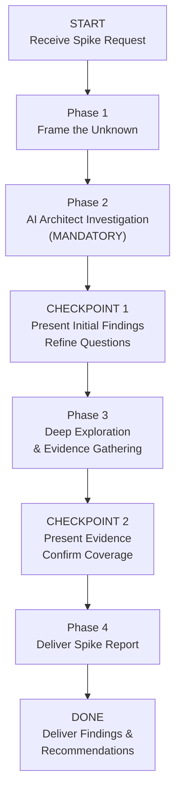

>  **Requires:** BitoAIArchitect MCP server configured and running. Ensure BitoAIArchitect MCP server is configured first.

# Spike / Research Analysis with AI Architect

## Purpose
Conduct a structured technical investigation when the team **does not yet know enough** to write a plan, design, or estimate. The output is **findings and recommendations** — not a plan, not a design, not a set of stories. A spike answers the question: "What do we now know that we didn't know before, and what should we do about it?"

**How this differs from other skills:**
- **Feature Plan** assumes you know *what* to build and produces *how*. A spike determines *whether* and *what's possible*.
- **TRD** assumes the approach is selected and produces a detailed design. A spike evaluates whether the approach is viable.
- **Feasibility Analysis** is a broader go/no-go assessment. A spike is a focused, time-boxed technical deep-dive into a specific unknown.

## Valid Workflow (State Machine)

The ONLY valid terminal state is `DONE`. You MUST pass through every phase and checkpoint in order. There are no shortcuts.

---

## Anti-Rationalization Table

| Rationalization | Why It's Wrong |
|---|---|
| "I already know the answer to this" | If the team is asking for a spike, they need *evidence*, not opinions. Your job is to gather proof from the codebase. |
| "This is simple — I can just recommend an approach" | Recommending without investigating is guessing. A spike that skips investigation is worthless. |
| "I'll investigate by thinking about it" | Investigation means reading code, checking dependencies, finding constraints. Reasoning without evidence is speculation, not research. |
| "The user just wants a quick answer" | A quick wrong answer wastes more time than a thorough right one. The team is blocked on this unknown — resolve it properly. |
| "I don't need AI Architect for this — it's a conceptual question" | Even conceptual questions ("can we support multi-tenancy?") require knowing the current data model, auth system, and service boundaries. |

**This skill applies to EVERY spike regardless of perceived simplicity.**

---

## Phase 1: Frame the Unknown

Before investigating, establish the spike frame (template in `references/output-templates.md`).

**Rules for good spike questions:**
- Must be **answerable from evidence** (code, architecture, data). "Should we use Kafka?" is not a spike question. "Does our current architecture support event-driven processing, and what would need to change?" is.
- Must be **specific enough to investigate**. "How should we scale?" is too broad. "Can the user-service database handle 10x write volume with the current schema?" is investigable.
- Must have **a clear "done" condition**. If you can't define what evidence would answer the question, the spike is not well-framed.

If the request is vague, work with the user to sharpen the question before proceeding.

---

## Phase 2: AI Architect Investigation (MANDATORY)

**Do NOT proceed to Checkpoint 1 until you have run AT LEAST 5 AI Architect queries across the categories below and documented what you found. Spike findings without AI Architect evidence are INVALID.**

The investigation categories depend on the spike type. Complete **all applicable** categories:

### For "Can we do X?" spikes (feasibility)

- [ ] **Current Architecture**
  What does the system look like today in the area the spike targets?
  - `getRepositoryInfo` with full detail for involved repos
  - `getRepositoryInfo` with `includeIncomingDependencies` and `includeOutgoingDependencies`
  - `listClusters` for service groupings

- [ ] **Existing Patterns**
  Has the org done something similar before? What patterns exist that could be reused or would conflict?
  - `searchRepositories` for similar feature keywords
  - `searchSymbols` for relevant types, handlers, patterns
  - `getCode` for existing implementations

- [ ] **Constraints & Limitations**
  What hard constraints exist in the current system that could block the proposed approach?
  - `searchSymbols` for schema definitions, config, limits
  - `getCode` for database schemas, API contracts, config files

### For "How does X work?" spikes (understanding)

- [ ] **Code Tracing**
  Follow the actual execution path through the codebase.
  - `searchSymbols` for entry points → `getCode` for each hop
  - Trace until the flow reaches a terminal (DB, queue, external API)

- [ ] **Data Flow**
  How does data move through the system for this feature?
  - `searchSymbols` for models, transformations, serialization
  - `getCode` for key transformation points

- [ ] **Hidden Dependencies**
  What non-obvious dependencies exist?
  - `getRepositoryInfo` with dependency flags for all services in the path
  - `searchCode` for cross-service calls, shared state, feature flags

### For "What would it take to change X?" spikes (impact)

- [ ] **Blast Radius**
  What depends on the thing being changed?
  - `getRepositoryInfo` with `includeIncomingDependencies` for the target
  - `searchCode` for usages of the target symbol/API across repos

- [ ] **Change Surface**
  What files, services, and contracts would need to change?
  - `searchSymbols` for the target across all relevant repos
  - `getCode` for each call site

- [ ] **Risk Areas**
  Where are the fragile or complex parts?
  - `getCode` for areas with complex logic, many branches, or limited tests
  - `searchSymbols` for test files related to the target

---

## CHECKPOINT 1: Present Initial Findings

After Phase 2, present what you've found so far:

1. **What we now know**: Key findings from the investigation
2. **What's still unclear**: Questions that remain unanswered
3. **Surprises**: Anything unexpected that changes the shape of the problem
4. **Refined questions**: Based on findings, are the original hypotheses still the right ones to evaluate?

**Ask the user**: "Here's what I've found so far. Should I dig deeper into any of these areas? Are the original hypotheses still the right ones, or should I investigate something else?"

**Do NOT proceed until the user confirms direction.**

---

## Phase 3: Deep Exploration & Evidence Gathering

Based on user feedback from Checkpoint 1, conduct targeted deep dives.

For each remaining question or hypothesis:

1. **State what you're looking for** and what evidence would confirm or refute it
2. **Search with AI Architect** — code-level evidence, not architectural guessing
3. **Record findings as evidence**, not conclusions:
   - `CONFIRMED: [claim] — evidence: [file:line, function, specific code]`
   - `REFUTED: [claim] — evidence: [what the code actually shows]`
   - `INCONCLUSIVE: [claim] — searched [what], found [what], still unclear because [why]`

### Evidence Standards

| Evidence Level | What It Means |
|---|---|
| **Confirmed from code** ✅ | Read the source. The function body, schema, config, or call site says this. |
| **Inferred from structure** ⚠️ | The architecture suggests this, but I didn't read the specific implementation. |
| **Speculative** ❓ | Based on naming conventions, documentation, or general patterns — not confirmed from code. |

**Every finding in the final report MUST carry one of these labels.**

---

## CHECKPOINT 2: Present Evidence

Present all gathered evidence organized by hypothesis/question. Ask: "Does this cover the unknowns we set out to resolve? Any remaining gaps before I write the final report?"

**Do NOT proceed until confirmed.**

---

## Phase 4: Deliver Spike Report

Apply the output template from `references/output-templates.md`.

---

## Notes

- **A spike is not a plan.** The output is findings and recommendations. If the team wants to proceed, they use Feature Plan, TRD, or Epic Breakdown for the next step.
- **Evidence over opinion.** Every claim in the spike report must trace to something found in the codebase. "I think this would work" is not a spike finding. "The current schema supports this because [field] at [file:line] already allows [value]" is.
- **Negative findings are valuable.** "We cannot do X because [constraint]" is a perfectly valid spike outcome. The team needs to know what's not possible as much as what is.
- **Time-boxing is implicit.** If after thorough investigation a question remains unresolved, document it as "What We Still Don't Know" with what was tried. Don't keep searching indefinitely — surface the gap and let the team decide whether to invest more.
- **Spikes can recommend follow-up spikes.** If investigation reveals a deeper unknown, recommend a focused follow-up spike rather than trying to answer everything in one pass.
